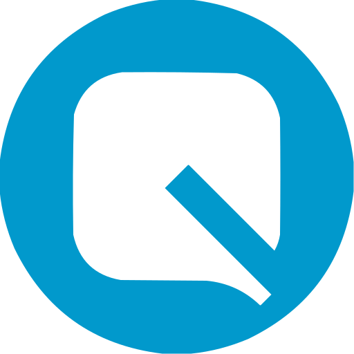
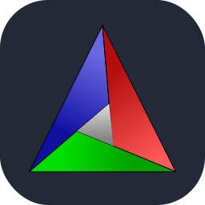

  <h1>
  
</h1>

  <h2 style="color:#DC143C ;font-size:4vw">🚀 <b>About Me</b></h2>
  
Computer Engineering Student in Isfahan University of Technology.

<h2 class="section-heading" style="color:#00FFFF;font-size:4vw">🌐 Reach Me</h2>

<h2 style="color:#7E84F7;font-size:4vw">💻 My Skils </h2>
  
  
  
  
  
  
  
  
  
  

<h2 style="color:#A1FB8E;font-size:3vw">🚨 To Learn
</h2>

  <h2 class="section-heading" style="color:#808080;font-size:4vw"> 📏 Github Stats</h2>
   
  <table align="left" width="100%" height="100%">
  <tbody><tr><td></td><td></td></tr></tbody>
</table>
   
  <table align="left" width="100%" height="100%">
  <tbody><tr><td></td><td></td><td></td></tr></tbody>
</table>

